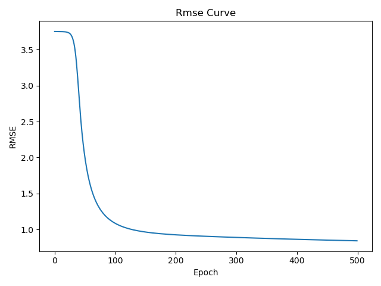
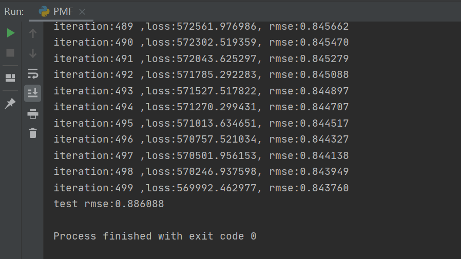

# RecSys-Homework
范元晓2020223040053
## hw1-PMF
论文
> Mnih A, Salakhutdinov R R. Probabilistic matrix factorization[J]. Advances in neural information processing systems, 2007, 20: 1257-1264.

##### 运行结果

